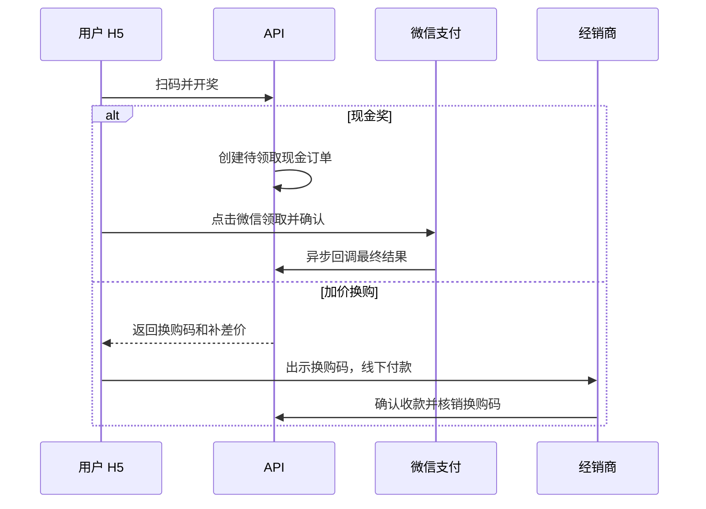

# 槟郎开袋扫码抽奖 MVP

基于 FastAPI、MySQL、Redis 的扫码抽奖系统，包含 React 管理后台、Vue H5 和经销商换购核销端。

## MVP 范围

系统只保留两类奖品：

| 奖品 | 用户流程 | 履约方式 |
|---|---|---|
| 现金奖 | 扫码、开奖、在微信内点击领取并确认收款 | 微信支付商家转账 |
| 加价换购 | 扫码、开奖、向经销商展示换购码 | 经销商线下收款后输入换购码核销 |

不提供实体奖品、积分、优惠券、券码、再来一次、后台人工兑奖、现金人工改状态或补货任务。历史数据表仍保留，仅用于审计；旧奖品不会参与新的抽奖。

## 核心流程



每个二维码只能开奖一次。服务端使用二维码短锁、数据库行锁、库存计数与幂等键阻止重复开奖和重复履约。

## 运营方式

1. 后台创建现金奖或加价换购奖，配置库存、单用户限额和奖池概率。
2. 创建并启用活动，关联二维码批次和奖池；可按经销商或地区发布独立奖池策略。
3. 创建二维码批次，导出印刷文件，登记二维码流向到经销商。
4. 现金奖由用户在微信内领取。后台只查看支付状态和流水，不得人工改写发放结果。
5. 换购奖由所属经销商查询用户展示的换购码；确认线下收款后执行一次核销。

## 微信现金发放

现金奖通过微信支付新版商家转账 (`/v3/fund-app/mch-transfer`) 发放。用户需要在微信内确认收款，支付最终状态只以微信回调为准。

生产环境必须启用微信支付：

```dotenv
WECHATPAY_ENABLED=true
WECHAT_APP_ID=
WECHAT_APP_SECRET=
WECHATPAY_MCHID=
WECHATPAY_MCH_SERIAL_NO=
WECHATPAY_MCH_PRIVATE_KEY_PATH=./secrets/wechatpay/apiclient_key.pem
WECHATPAY_MCH_PUBLIC_KEY_ID=
WECHATPAY_MCH_PUBLIC_KEY_PATH=./secrets/wechatpay/wechatpay_public_key.pem
WECHATPAY_API_V3_KEY=
WECHATPAY_NOTIFY_BASE_URL=https://example.com
H5_BASE_URL=https://example.com/scan
```

本地 PEM 放在 `secrets/wechatpay/apiclient_key.pem` 与 `secrets/wechatpay/wechatpay_public_key.pem`（该目录已 gitignore，不要提交私钥）。生产环境将变量改为服务账号可读的绝对路径。

想快速跑起来先看一分钟版 [`docs/QUICKSTART.md`](docs/QUICKSTART.md)；完整变量含义与校验清单见 [`docs/configuration-checklist.md`](docs/configuration-checklist.md)。

还需要在微信侧完成：公众号网页授权域名和 JS 安全域名配置（需上传 `MP_verify_*.txt` 校验文件）、商家转账产品开通、营销场景报备、商户号与公众号 AppID 绑定，以及通知地址可被公网 HTTPS 访问。

正式公众号、商户号、证书、公钥、回调和上线验收步骤见 [`docs/wechat-production.md`](docs/wechat-production.md)。生产环境必须显式配置 OAuth 回调地址和支付回调基址。

常驻服务包括 MySQL、Redis、API 和 `wechat-pay-worker`。该 worker 创建、查询或撤销转账单；微信支付通知由 `/api/wechat-pay/notify` 接收并验签落库。

## 首次运行

复制模板并按 [`docs/QUICKSTART.md`](docs/QUICKSTART.md) 填 3 处；逐项核对见 [`docs/configuration-checklist.md`](docs/configuration-checklist.md)：

```bash
cp .env.example .env          # 已存在则跳过；.env 不入库
```

`ENVIRONMENT=development` 下的最小可跑配置只有数据库与 Redis 连接串，其余（OAuth、微信支付）留空即可跑通抽奖主流程。`JWT_SECRET` 一旦用于生成二维码就不要再改：二维码 token、中奖 token、会话都靠它派生加密。

后台账号 `ADMIN_BOOTSTRAP_USERNAME` / `ADMIN_BOOTSTRAP_PASSWORD` **只在账号不存在时创建**，改 `.env` 不会更新已存在的行。首次启动后建议立刻用脚本设置强口令：

```bash
./.venv/bin/python -m scripts.set_admin_password --username admin
```

## 本地运行

```bash
# 仅首次初始化空数据库
./.venv/bin/python -m scripts.init_db
# 启动 API、worker 和三个前端；MySQL/Redis 需先由本机或外部服务提供
./scripts/run_local.sh --frontends
```

默认入口：

| 页面 | 地址 |
|---|---|
| 管理后台 | `http://localhost:5173` |
| 用户 H5 | `http://localhost:5174/?t=<二维码token>` |
| 经销商核销端 | `http://localhost:5175` |
| API 文档 | `http://localhost:8000/docs` |
| MySQL / Redis | 由 `.env` 中的 `DATABASE_URL` / `REDIS_URL` 指定 |

API 与 wechat-pay-worker 由 `./scripts/run_local.sh` 用 `.venv` 原生启动。该脚本只检查 MySQL/Redis 连通性，不启动基础设施，也不执行数据库迁移。首次使用空库时，先按数据库初始化说明手动创建表；已有数据库升级也必须手动执行并核对迁移。应用启动只会在管理员账号不存在时创建初始管理员。

也可分别启动：

```bash
./.venv/bin/uvicorn app.main:app --reload        # 只启动 API
./scripts/run_local.sh api                        # 检查依赖后只启动 API
./scripts/run_local.sh worker                     # 检查依赖后只启动 worker
npm --prefix frontend/admin run dev               # 管理后台
npm --prefix frontend/h5 run dev                  # 用户 H5
npm --prefix frontend/dealer run dev              # 经销商核销端
```

没有公网服务器时，可用 ngrok 做公众号和微信支付的初步联调。脚本会把隧道域名写进**独立的覆盖层** `.env.ngrok`（不污染 `.env`），并自动重启本地 API/worker 进程：

```bash
./scripts/run_ngrok_local.sh                      # 启动 H5 + 隧道 + 回写配置 + 冒烟自检
./scripts/run_ngrok_local.sh check                # 只体检，不启动进程
NGROK_DOMAIN=promo.ngrok.app ./scripts/run_ngrok_local.sh   # 使用预留固定域名
```

详见 [`docs/ngrok-local.md`](docs/ngrok-local.md)。

> API 默认以 `--reload` 模式运行，改动 `app/` 或 `scripts/` 的 Python 代码后自动热重载，无需手动重启。

## 关键 API

| 用途 | 路径 |
|---|---|
| H5 核验二维码 | `POST /api/h5/scan/validate` |
| H5 开奖 | `POST /api/h5/lottery/draw` |
| H5 微信领取现金 | `POST /api/h5/lottery/records/{record_id}/cash-claim` |
| H5 查看我的奖品 | `GET /api/h5/lottery/records` |
| 经销商查询换购码 | `POST /api/dealer/upgrade-orders/lookup` |
| 经销商确认收款并核销 | `POST /api/dealer/upgrade-orders/redeem` |
| 门店 PIN 核销 | `POST /api/store/redeem` |

所有后台奖品创建与编辑接口只接受 `cash` 和 `upgrade`。通用兑奖、券码、积分、补货、现金人工履约等旧接口均返回 HTTP 410。

## 反向代理与真实客户端 IP

后台登录限流、抽奖风控和审计日志都按客户端 IP 记账。`TRUST_PROXY_HEADERS=true`（默认）时，API 只在请求**直接来自**内置受信代理网段（回环 + RFC1918/RFC4193 + 链路本地，见 `app/core/http.py` 的 `TRUSTED_PROXY_NETWORKS`）时才采信 `X-Forwarded-For`，否则回退到 socket 对端地址，避免任意调用方伪造 IP 绕过限流。

- 本地直连（本机 `curl 127.0.0.1:8000`）：`127.0.0.1` 在默认受信网段内，能正确取到 IP。
- 内网反向代理：来源是 `172.16.0.0/12`、`10.0.0.0/8` 等 RFC1918 网段，已在默认白名单内；如果你的代理用了公网地址，需在该常量里补上对应网段，否则 IP 会退化成代理地址。
- nginx / ngrok：TLS 在代理侧终止，代理必须用 `proxy_set_header X-Forwarded-For $remote_addr;` **覆盖**而非追加该头，否则客户端可自带伪造值。详见 [`docs/wechat-production.md`](docs/wechat-production.md)。

## 验证

```bash
./.venv/bin/python -m compileall -q app scripts
./.venv/bin/pytest -q
npm --prefix frontend/admin run build
npm --prefix frontend/h5 run build
npm --prefix frontend/dealer run build
./scripts/run_ngrok_local.sh check     # ngrok 联调配置一致性体检（未用隧道可跳过）
```
